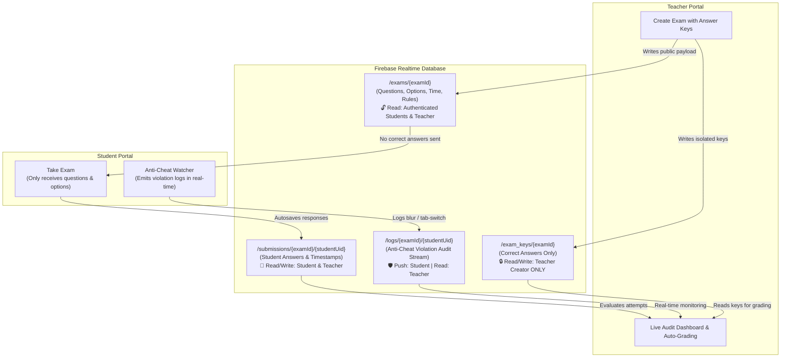

# 🎓 ExamTaker — Serverless Online Exam Platform with Real-Time Anti-Cheat

<div align="center">


[](https://react.dev/)
[](https://www.typescriptlang.org/)
[](https://vitejs.dev/)
[](https://tailwindcss.com/)
[](https://firebase.google.com/)
[](https://github.com/)
[](LICENSE)

**A high-integrity, serverless web evaluation platform with live anti-cheat telemetry, server-synchronized countdowns, zero-leak answer key isolation, and instant auto-grading.**

[Explore Features](#-key-features) • [Architecture](#-zero-leak-security-architecture) • [Getting Started](#-getting-started) • [Anti-Cheat Engine](#-anti-cheat-telemetry-engine) • [Deployment](#-ci-cd--deployment)

</div>

---

## 🌟 Overview

**ExamTaker** is a modern, high-performance web platform designed for academic institutions, educators, and certification bodies that need a secure, hassle-free evaluation environment. 

Operating on a **100% serverless architecture** backed by **Firebase Realtime Database** and **Firebase Authentication**, ExamTaker guarantees real-time synchronization, automatic student attempt autosaving, and active supervision without requiring expensive backend server management.

---

## ✨ Key Features

### 👨‍🏫 Teacher Studio
- **Intuitive Exam Builder**: Craft timed assessments with custom title, instructions, time limit, and maximum allowed violations.
- **Dynamic Questions**: Single and multiple-choice questions with per-question scoring, option shuffling, and explanations.
- **PIN & Link Access**: Generates secure alphanumeric PIN access codes for instant student entry.
- **Live Submission & Audit Monitor**: Real-time dashboard showing student statuses (`in_progress`, `submitted`, `timed_out`, `disqualified`).
- **Live Anti-Cheat Log Stream**: Review timestamped violation events (loss of focus, tab switching, devtools inspection, copy/paste attempts) per student.
- **Instant Auto-Grading**: Securely evaluates submissions against the protected answer key upon student completion.

### 🧑‍🎓 Student Experience
- **Frictionless Entry**: Join directly with a PIN and student credentials without complex registration (uses transparent anonymous authentication).
- **Distraction-Free Interface**: Clean, accessible, focused UI optimized for readability and concentration.
- **Auto-Save Resilience**: Every option selected is immediately synchronized to the cloud; accidental reloads or connection drops never lose progress.
- **Synchronized Countdown**: Server-calibrated countdown timer preventing local device clock manipulation.
- **Instant Feedback & Score Breakdown**: Post-submission overview with scores, percentage, and detailed evaluation.

### 🛡️ Anti-Cheat Telemetry Engine
- **Tab & Window Focus Loss**: Detects when students switch browser tabs, open external applications, or move to secondary monitors (`visibilitychange` and `blur` events).
- **Right-Click & Context Menu Interception**: Prevents context menu shortcuts for text searches or external lookups.
- **DevTools & Source Code Blocking**: Intercepts `F12`, `Ctrl+Shift+I`, `Ctrl+Shift+J`, and `Ctrl+U`.
- **Copy / Paste Prevention**: Restricts clipboard shortcuts (`Ctrl+C`, `Ctrl+V`, `Cmd+C`, `Cmd+V`) during active exam sessions.
- **Progressive Warnings & Auto-Disqualification**: Displays non-intrusive alert modals with infraction counts; immediately locks the exam if the threshold is exceeded.

### ⚡ Built-in Mock Fallback Mode
- No Firebase project yet? ExamTaker automatically detects missing Firebase configuration and falls back to a full-featured **Local Storage Mock Simulation**, allowing testing, grading, and anti-cheat evaluations out of the box.

---

## 🔒 Zero-Leak Security Architecture

A primary vulnerability of client-side exam platforms is exposing correct answers in the network payload or client memory. **ExamTaker eliminates this vulnerability by design**:



### Security Highlights:
1. **Separation of Keys**: Correct answers are stored strictly under `/exam_keys/{examId}`, where Realtime Database rules deny read access to everyone except the authenticated teacher who created the exam.
2. **Immutable Finalization**: Once a submission's status changes from `in_progress` to `submitted`, `timed_out`, or `disqualified`, write rules lock answers from further client modification.
3. **Server-Offset Clock**: Exam duration relies on Firebase's `.info/serverTimeOffset` to eliminate cheating by adjusting local machine clocks.

---

## 🛠️ Tech Stack

| Domain | Technology | Description |
|---|---|---|
| **Frontend Framework** | [React 19](https://react.dev/) | Component architecture with modern hooks |
| **Language** | [TypeScript 6](https://www.typescriptlang.org/) | Strict type safety and clear domain models |
| **Build & Dev Tool** | [Vite 8](https://vitejs.dev/) | Ultra-fast HMR and optimized production bundle |
| **Styling** | [Tailwind CSS v4](https://tailwindcss.com/) | Modern utility-first design system with dark-mode aesthetic |
| **Routing** | [React Router 7](https://reactrouter.com/) | HashRouter for GitHub Pages SPA compatibility |
| **Icons** | [Lucide React](https://lucide.dev/) | Accessible, modern iconography |
| **Effects** | [Canvas-Confetti](https://www.npmjs.com/package/canvas-confetti) | Visual celebration on successful submission |
| **Database & Auth** | [Firebase 12](https://firebase.google.com/) | Realtime Database and Firebase Authentication |
| **Linter** | [Oxlint](https://oxc.rs/) | Rust-powered high-speed JavaScript/TypeScript linter |
| **CI/CD** | [GitHub Actions](https://github.com/features/actions) | Automated build and deployment to GitHub Pages |

---

## 📁 Directory Structure

```text
ExamTaker/
├── .github/
│   └── workflows/
│       └── deploy.yml          # GitHub Actions deployment workflow
├── public/
│   ├── 404.html                # SPA fallback for static hosting
│   ├── favicon.svg             # Application favicon
│   └── icons.svg               # SVG icons asset
├── src/
│   ├── assets/                 # Brand assets and graphics (hero, logo)
│   ├── components/
│   │   └── common/
│   │       └── Navbar.tsx      # Global responsive navigation bar
│   ├── contexts/
│   │   └── AuthContext.tsx     # Teacher authentication & session provider
│   ├── hooks/
│   │   ├── useAntiCheat.ts     # Anti-cheat listeners, throttling & telemetry
│   │   └── useServerTimer.ts   # Server-synchronized countdown hook
│   ├── pages/
│   │   ├── LandingPage.tsx     # Landing page with platform overview & quick access
│   │   ├── TeacherAuth.tsx     # Teacher login / registration form
│   │   ├── TeacherDashboard.tsx# Teacher exam overview, stats & actions
│   │   ├── ExamEditor.tsx      # Comprehensive exam creator and editor
│   │   ├── ExamAudit.tsx       # Live submission dashboard and violation logs
│   │   ├── StudentEntry.tsx    # PIN validation and student entry gate
│   │   ├── StudentExam.tsx     # Live examination interface with anti-cheat
│   │   └── ExamFinished.tsx    # Post-submission feedback and score preview
│   ├── services/
│   │   ├── firebase.ts         # Firebase App, Auth, and Database initialization
│   │   ├── firebaseConfig.ts   # Environment-based Firebase configuration
│   │   ├── examService.ts      # Exam CRUD operations with mock fallback
│   │   ├── studentService.ts   # Submissions, answers, and violation logging
│   │   └── mockStorage.ts      # LocalStorage simulation engine for offline dev
│   ├── types/                  # Domain TypeScript interfaces (exam, auth, log, submission)
│   ├── App.tsx                 # Route declarations & role-based guards
│   ├── index.css               # Global CSS & Tailwind imports
│   └── main.tsx                # Application bootstrap entrypoint
├── database.rules.json         # Firebase Realtime Database security rules
├── firebase.json               # Firebase CLI hosting and database setup
├── vite.config.ts              # Vite bundler configuration
└── package.json                # Project dependencies and npm scripts
```

---

## 🚀 Getting Started

### Prerequisites
- **Node.js**: `v20.x` or `v22.x` (LTS recommended)
- **Package Manager**: `npm` (v10+) or `pnpm` / `yarn`

### 1. Clone the Repository
```bash
git clone https://github.com/Jlebot7/ExamTaker.git
cd ExamTaker
```

### 2. Install Dependencies
```bash
npm install
```

### 3. Configure Environment Variables
Create a `.env` file in the root directory by copying `.env.example`:

```bash
cp .env.example .env
```

Fill in your Firebase project credentials (optional for initial preview thanks to the built-in mock fallback):

```env
VITE_FIREBASE_API_KEY=AIzaSyYourApiKeyHere
VITE_FIREBASE_AUTH_DOMAIN=your-project.firebaseapp.com
VITE_FIREBASE_DATABASE_URL=https://your-project-default-rtdb.firebaseio.com
VITE_FIREBASE_PROJECT_ID=your-project-id
VITE_FIREBASE_STORAGE_BUCKET=your-project.firebasestorage.app
VITE_FIREBASE_MESSAGING_SENDER_ID=123456789012
VITE_FIREBASE_APP_ID=1:123456789012:web:abcdef1234567890
```

> **Note**: If environment variables are omitted or invalid, ExamTaker activates its **Mock Storage Fallback** mode, allowing complete demonstration without remote setup.

### 4. Run Locally
```bash
npm run dev
```
Open your browser and navigate to `http://localhost:5173`.

---

## 🛡️ Firebase Security Rules Setup

To deploy the production security rules to your Firebase Realtime Database:

1. Install the Firebase CLI:
   ```bash
   npm install -g firebase-tools
   ```
2. Authenticate with your Firebase account:
   ```bash
   firebase login
   ```
3. Deploy database rules from `database.rules.json`:
   ```bash
   firebase deploy --only database
   ```

---

## 📦 Available Scripts

| Script | Command | Description |
|---|---|---|
| **Development** | `npm run dev` | Starts Vite local dev server with Hot Module Replacement (HMR) |
| **Typecheck & Build** | `npm run build` | Compiles TypeScript and builds production distribution in `/dist` |
| **Linting** | `npm run lint` | Runs high-speed Oxlint code analysis |
| **Preview** | `npm run preview` | Locally serves the production build |

---

## 🌐 CI/CD & Deployment

This project includes a production-ready **GitHub Actions Workflow** (`.github/workflows/deploy.yml`) configured to build and deploy the application to **GitHub Pages**.

### Setting up automated GitHub Pages deployment:
1. Go to your repository on GitHub: **Settings > Pages**.
2. Under **Source**, select **GitHub Actions**.
3. Under **Settings > Secrets and variables > Actions**, add the `VITE_FIREBASE_*` secrets if you are using live Firebase.
4. Push to `main` or `master` to trigger the automated build and release.

---

## 🤝 Contributing

Contributions are welcome! Please follow these steps:

1. Fork the project.
2. Create a feature branch:
   ```bash
   git checkout -b feat/my-amazing-feature
   ```
3. Commit your changes following [Conventional Commits](https://www.conventionalcommits.org/):
   ```bash
   git commit -m "feat(audit): add CSV export for student exam logs"
   ```
4. Push to the branch:
   ```bash
   git push origin feat/my-amazing-feature
   ```
5. Open a Pull Request.

---

## 📄 License

This project is licensed under the **MIT License**. See the `LICENSE` file for details.
